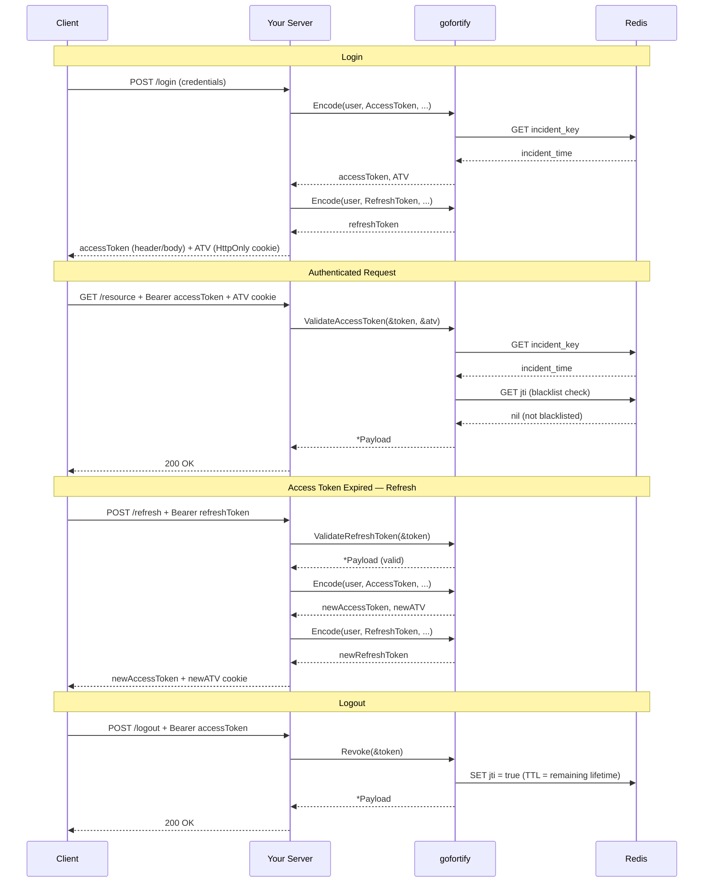
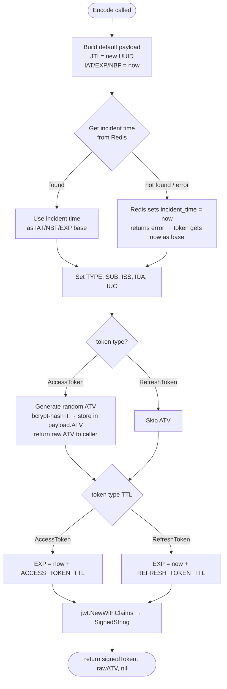
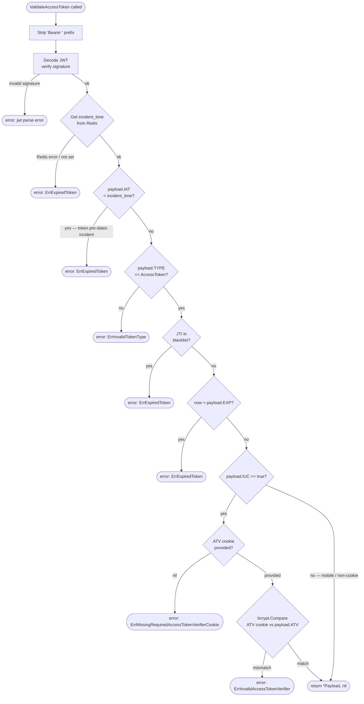
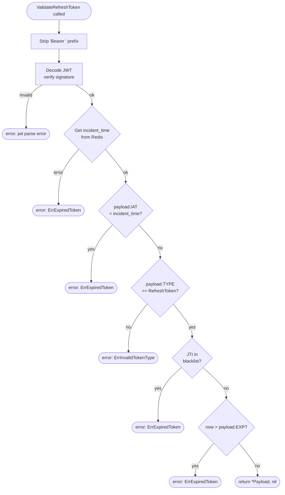
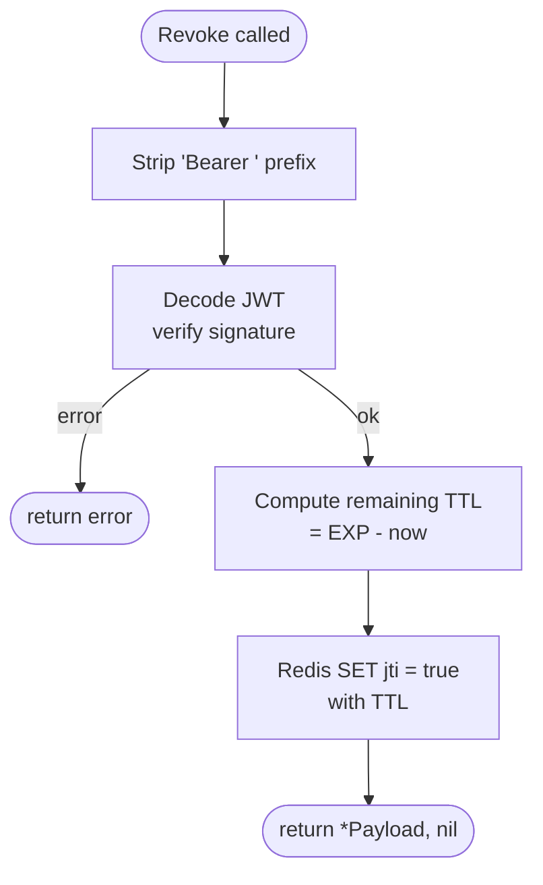
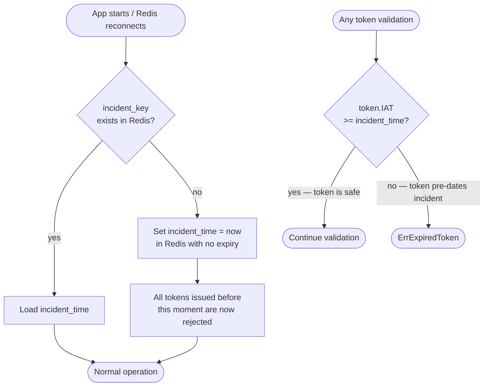

# gofortify

A Go library for JWT-based authentication with access/refresh token management, token revocation via Redis blacklist, and incident-time protection.

## Features

- Generate signed access and refresh tokens with configurable TTL
- Validate access tokens with optional Access Token Verifier (ATV) cookie binding
- Validate refresh tokens
- Revoke tokens by adding them to a Redis-backed blacklist
- Incident-time protection: tokens issued before a recorded incident time are automatically rejected
- Supports multiple JWT signing methods (HS256, HS384, HS512, RS*, ES*, PS*, EdDSA)

## Flow Diagrams

### Overall Auth Flow



---

### Token Generation (`Encode`)



---

### Access Token Validation (`ValidateAccessToken`)



---

### Refresh Token Validation (`ValidateRefreshToken`)



---

### Token Revocation (`Revoke`)



---

### Incident Time Protection



## Requirements

- Go 1.25+
- Redis (used for token blacklist and incident time tracking)

## Installation

```bash
go get github.com/iqbalatma/gofortify
```

## Configuration

gofortify reads its configuration from environment variables. Call `LoadJWTConfig()` and `ConnectRedis()` once at application startup.

```go
import (
    "github.com/iqbalatma/gofortify/config"
)

func main() {
    config.LoadJWTConfig()
    config.ConnectRedis()
    // ...
}
```

### Environment Variables

| Variable                        | Description                                            | Default  |
|---------------------------------|--------------------------------------------------------|----------|
| `JWT_SECRET_KEY`                | Secret key used to sign tokens                         | —        |
| `JWT_SIGNING_METHOD`            | Signing algorithm (e.g. `HS256`, `RS256`)              | —        |
| `JWT_ACCESS_TOKEN_TTL`          | Access token TTL in minutes                            | `30`     |
| `JWT_REFRESH_TOKEN_TTL`         | Refresh token TTL in minutes                           | `10080`  |
| `JWT_REDIS_HOST`                | Redis host                                             | —        |
| `JWT_REDIS_PORT`                | Redis port                                             | —        |
| `JWT_REDIS_PASSWORD`            | Redis password                                         | —        |
| `JWT_REDIS_DB`                  | Redis database index                                   | —        |
| `JWT_BLACKLIST_INCIDENT_TIME_KEY` | Redis key used to store the incident timestamp       | —        |

### Supported Signing Methods

Set `JWT_SIGNING_METHOD` to one of the values below.

#### HMAC — Symmetric (shared secret key)

| Algorithm | Hash   | Notes                              |
|-----------|--------|------------------------------------|
| `HS256`   | SHA-256 | Default choice, fast, widely supported |
| `HS384`   | SHA-384 | Larger hash, marginally more secure |
| `HS512`   | SHA-512 | Largest hash in the HMAC family    |

> Use HMAC when the same service both signs and verifies tokens. The secret key must be kept private.

#### RSA — Asymmetric (private key signs, public key verifies)

| Algorithm | Hash    | Key size recommendation |
|-----------|---------|-------------------------|
| `RS256`   | SHA-256 | 2048-bit minimum        |
| `RS384`   | SHA-384 | 2048-bit minimum        |
| `RS512`   | SHA-512 | 4096-bit recommended    |

> Use RSA when you need to share the verification key publicly (e.g. between microservices) while keeping the signing key private.

#### ECDSA — Asymmetric (elliptic curve)

| Algorithm | Curve   | Hash    | Notes                     |
|-----------|---------|---------|---------------------------|
| `ES256`   | P-256   | SHA-256 | Recommended — compact keys |
| `ES384`   | P-384   | SHA-384 | Higher security margin     |
| `ES512`   | P-521   | SHA-512 | Strongest ECDSA option     |

> ECDSA produces much smaller keys and signatures than RSA at equivalent security levels.

#### RSA-PSS — Asymmetric (RSA with probabilistic padding)

| Algorithm | Hash    | Notes                                    |
|-----------|---------|------------------------------------------|
| `PS256`   | SHA-256 | More secure padding scheme than RS256    |
| `PS384`   | SHA-384 |                                          |
| `PS512`   | SHA-512 |                                          |

> PSS is the modern, recommended RSA padding scheme. Prefer `PS256` over `RS256` for new systems.

#### EdDSA — Asymmetric (Edwards-curve)

| Algorithm | Curve    | Notes                                          |
|-----------|----------|------------------------------------------------|
| `EdDSA`   | Ed25519  | Fastest asymmetric option, very small keys/signatures |

> EdDSA (Ed25519) is the recommended choice for new asymmetric setups — fast, secure, and compact.

#### Quick Recommendation

| Scenario | Recommended algorithm |
|---|---|
| Simple single-service app | `HS256` |
| Microservices with public verification | `ES256` or `EdDSA` |
| Compliance requiring RSA | `PS256` |
| Maximum security budget | `EdDSA` or `ES512` |

## Usage

### Implement `JWTSubject`

Your user/entity struct must implement the `JWTSubject` interface so gofortify knows what to embed as the token subject (`sub` claim).

```go
type User struct {
    ID   int
    Name string
}

func (u *User) GetSubjectKey() string {
    return strconv.Itoa(u.ID)
}
```

### Encode (Generate Tokens)

```go
import "github.com/iqbalatma/gofortify"

user := &User{ID: 1, Name: "Alice"}

// Generate an access token
tokenString, accessTokenVerifier, err := gofortify.Encode(
    user,                      // JWTSubject
    gofortify.AccessToken,     // token type
    true,                      // iuc: true = using cookie (enables ATV binding)
    "my-service",              // iss: issuer
    "Mozilla/5.0 ...",         // iua: issued user agent
)

// Generate a refresh token
refreshString, _, err := gofortify.Encode(
    user,
    gofortify.RefreshToken,
    false,
    "my-service",
    "Mozilla/5.0 ...",
)
```

`Encode` returns:
- `tokenString` — the signed JWT string
- `accessTokenVerifier` — a raw ATV value (only set for access tokens with `iuc: true`); store this in an `HttpOnly` cookie and send it alongside the token
- `err` — any error

### Validate Access Token

```go
token := "Bearer eyJ..."
atv := "atv-value-from-cookie" // pass nil if iuc is false

payload, err := gofortify.ValidateAccessToken(&token, &atv)
if err != nil {
    // handle: gofortify.ErrExpiredToken, gofortify.ErrInvalidTokenType,
    //         gofortify.ErrMissingRequiredAccessTokenVerifierCookie,
    //         gofortify.ErrInvalidAccessTokenVerifier
}

fmt.Println(payload.SUB) // subject (user ID)
```

### Validate Refresh Token

```go
token := "Bearer eyJ..."

payload, err := gofortify.ValidateRefreshToken(&token)
if err != nil {
    // handle error
}
```

### Revoke a Token

Adds the token's JTI to the Redis blacklist with a TTL equal to the remaining token lifetime.

```go
token := "Bearer eyJ..."

payload, err := gofortify.Revoke(&token)
if err != nil {
    // handle error
}
```

### Decode (Raw)

Decode parses and verifies a JWT string and returns its payload without any additional validation.

```go
payload, err := gofortify.Decode(tokenString)
```

## Token Payload

| Claim  | Field | Description                                      |
|--------|-------|--------------------------------------------------|
| `iss`  | ISS   | Issuer                                           |
| `iat`  | IAT   | Issued at (Unix timestamp)                       |
| `exp`  | EXP   | Expires at (Unix timestamp)                      |
| `nbf`  | NBF   | Not valid before (Unix timestamp)                |
| `jti`  | JTI   | Unique token identifier (UUID)                   |
| `sub`  | SUB   | Subject (from `JWTSubject.GetSubjectKey()`)      |
| `iua`  | IUA   | Issued user agent                                |
| `iuc`  | IUC   | Is using cookie (enables ATV check)              |
| `type` | TYPE  | Token type: `access_token` or `refresh_token`    |
| `atv`  | ATV   | Access token verifier (bcrypt hash, access only) |

## Errors

| Error                                          | Meaning                                                    |
|------------------------------------------------|------------------------------------------------------------|
| `ErrExpiredToken`                              | Token is expired or was issued before the incident time    |
| `ErrInvalidTokenType`                          | Wrong token type used for the operation                    |
| `ErrMissingRequiredAccessTokenVerifierCookie`  | `iuc` is true but no ATV cookie was provided               |
| `ErrInvalidAccessTokenVerifier`                | ATV cookie value does not match the token's ATV claim      |
| `ErrJWTSubjectNotFound`                        | Subject could not be resolved                              |

## Security Notes

- **Incident time**: On startup (or Redis loss), gofortify sets an incident timestamp. Any token issued before this time is rejected, providing a global revocation mechanism when the blacklist is unavailable.
- **ATV (Access Token Verifier)**: When `iuc` is `true`, a bcrypt-hashed verifier is embedded in the token and the raw value must be supplied via a separate `HttpOnly` cookie. This mitigates token theft from JavaScript.
- **Redis blacklist**: Revoked token JTIs are stored in Redis with a TTL matching the remaining token lifetime, so the blacklist stays self-cleaning.

## License

MIT